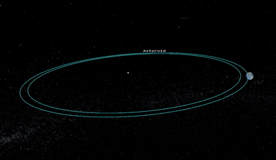

# ARGUS (Meteor Madness)

[](LICENSE)  
[]()  
[]()

---

## 🚀 Project Overview



**ARGUS** (Aerial & Ground-based Unified System) is a prototype/experimental platform developed for the **NASA Space Apps Challenge 2025**.  
It is intended as both a **research tool** and a **decision-support engine** for evaluating near-Earth object (NEO) behavior, impact effects, and mitigation strategies.

Key capabilities:

- A high-fidelity **3D simulator** of orbital dynamics, impact physics, trajectory deflection, and collision effects
- Fetching real asteroid data from NASA’s NeoWs (Near Earth Object Web Service) API
- Rendering trajectories, orbits, collisions, and crater formation using physical equations
- Supporting studies such as:
  1. Simulating predicted close-approach asteroids using Kepler’s laws adapted by the project’s physics team
  2. Modeling what would happen if an asteroid is perturbed to hit Earth — computing crater size and impact effects
  3. Evaluating deflection strategies (e.g. kinetic impactors like NASA’s DART) by simulating trajectory deviation mechanisms

ARGUS is currently intended for **local execution only** (no cloud deployment), but is structured to be extensible for larger usage.

## 🎬 Screenshots & GIFs

Below are sample images or GIFs to showcase ARGUS in action.

| View | Preview |
|------|---------|
| Dashboard view |  |
| Real-time meteor event |  |
| Map + data overlay |  |


## ⚙️ Requirements & Technologies

### Core Technologies

- Node.js: backend server, simulation logic, data fetching

- Three.js: for 3D rendering of orbits, trajectories, collisions

- Axios: HTTP client for fetching NASA API data

- NASA NeoWs (Near Earth Object Web Service): used to fetch asteroid catalog, orbital parameters, and close approach data

## 🛠️ Getting Started (Local)

Follow these steps to get ARGUS running on your local machine:

1. **Backend (Node)**  
   ```bash
   cd be-node
   npm install
   npm run dev
   ```

2. **Frontend (Three.JS)**  
   ```bash
   cd frontend
   npm install
   npm run dev
   ```

Once both are running, open your browser to the front-end local address (e.g. http://localhost:3000 or whatever the dev server prints) to interact with ARGUS.

> ⚠️ Make sure both backend and frontend are up simultaneously. The frontend relies on the backend WebSocket / REST endpoints.

## ✅ Use Cases & Objectives

ARGUS is designed to support:

- Investigation of predicted near-Earth asteroids and their orbital dynamics

- “What-if” impact scenario simulations (if a predicted object is forced into collision)

- Assessment of deflection strategies (e.g. kinetic impact, gravity tractor) and their efficacy

- Support to non-technical stakeholders (governments, agencies) by converting physical simulation into visual, intuitive outputs for decision making
